# Zolver

> 건국대학교 글로컬캠퍼스 학생을 위한 **졸업요건 분석 서비스**

**서비스 링크: [www.zolver.co.kr](https://www.zolver.co.kr)**

> 현재 베타 서비스로 운영 중입니다. 일부 기능이 변경되거나 오류가 발생할 수 있습니다.

---

## 서비스 소개

학교 포털에서 성적표(.xlsx)를 다운로드해 업로드하면, 커리큘럼 기준에 따라 이수 과목을 자동 분류하고 졸업까지 남은 요건을 시각적으로 확인할 수 있습니다.

단순한 학점 합산을 넘어, 태그 기반 세부 이수 현황 추적 / 수강 시뮬레이션 / GPA 분석 / **AI 수강 추천**까지 제공합니다.

---

## 주요 기능

| 기능 | 설명 |
|---|---|
| **이수 과목 등록** | .xlsx 성적표 업로드 또는 직접 입력으로 수강 이력 등록 |
| **졸업요건 분석** | 전공·교양·기타 학점 달성률 실시간 확인 |
| **이수 현황** | 태그(전필·전선·소분류 등)별 세부 이수 현황 및 달성 여부 |
| **태그 관리** | 전공·교양·기타 과목의 세부 영역을 태그로 직접 구성, 최소 이수학점 설정 |
| **수강 시뮬레이션** | 앞으로 들을 과목을 미리 등록해 졸업요건 달성 여부 시뮬레이션, 초성 검색 지원 |
| **GPA 분석** | 학기별 GPA 추이 시각화, 목표 GPA 달성 시뮬레이션 |
| **과목 모아보기** | 관리자 등록 과목 + 신뢰도 알고리즘으로 시스템 검증된 과목 검색 (초성 검색 지원) |
| **AI 수강 추천** | 졸업요건·GPA·학번·학과 데이터 기반 이번 학기 수강 전략 AI 추천 (Gemini API) |
| **카카오 로그인** | 카카오 OAuth 기반 간편 로그인 |

---

## 스크린샷

### 대시보드
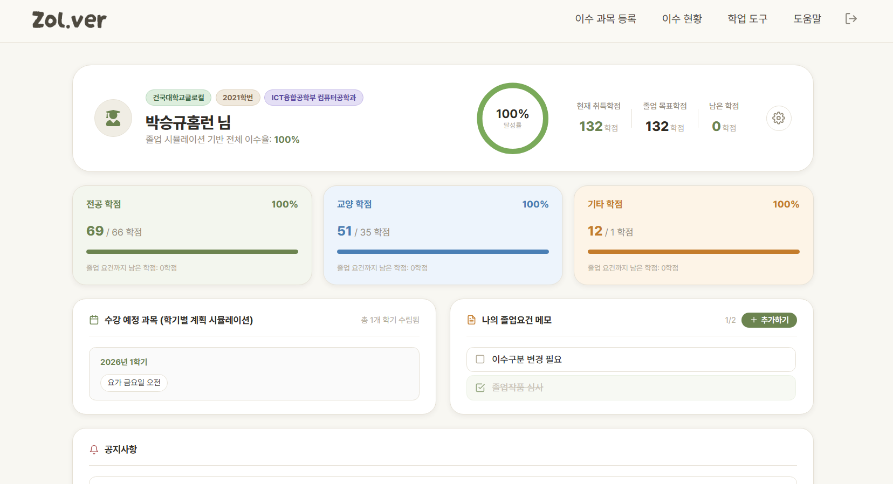

### 이수 과목 등록
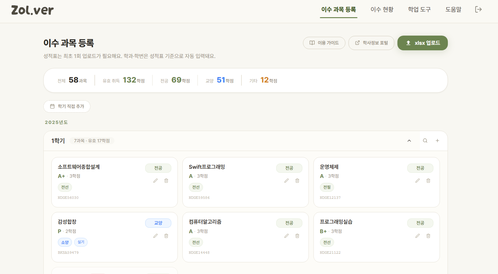

### 이수 현황 (전공 / 교양)
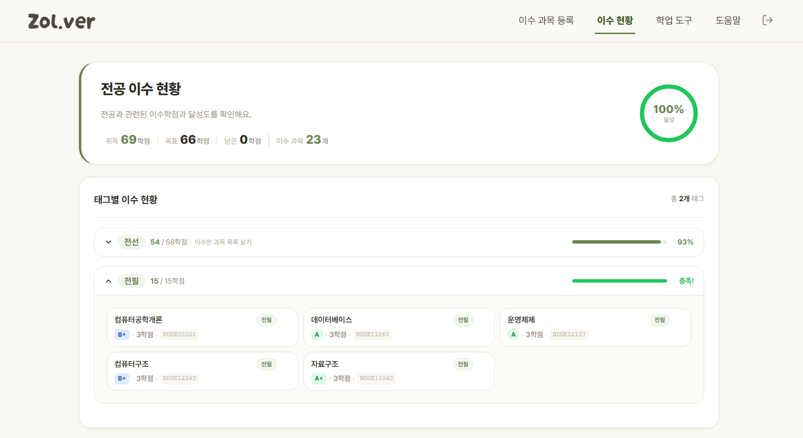
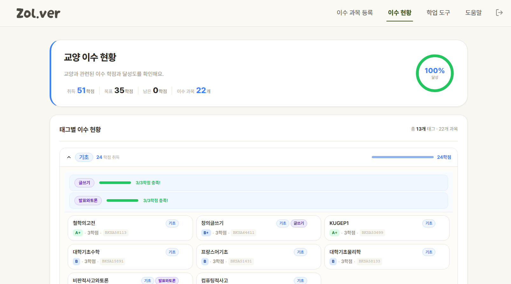

### 학업 도구 — 태그 관리 / GPA 분석 / 수강 시뮬레이션 / 과목 모아보기
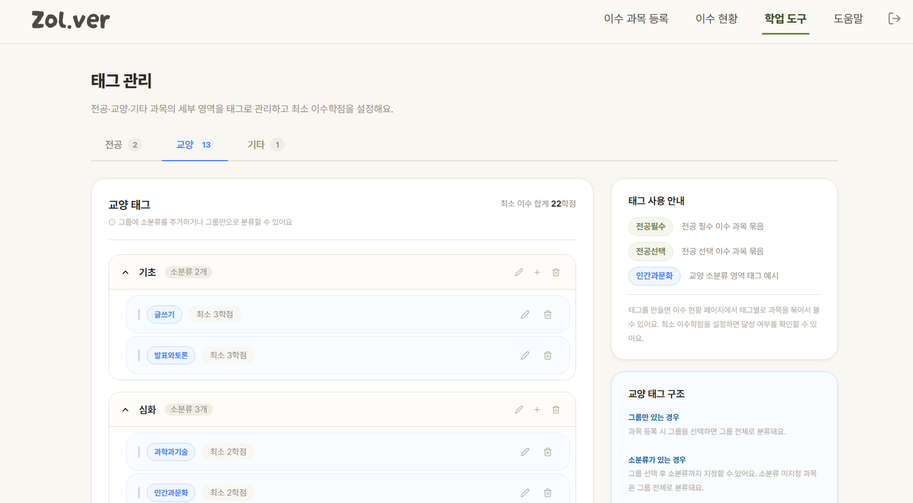
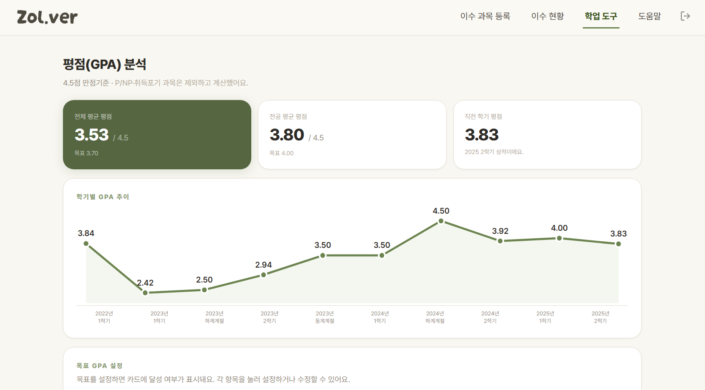
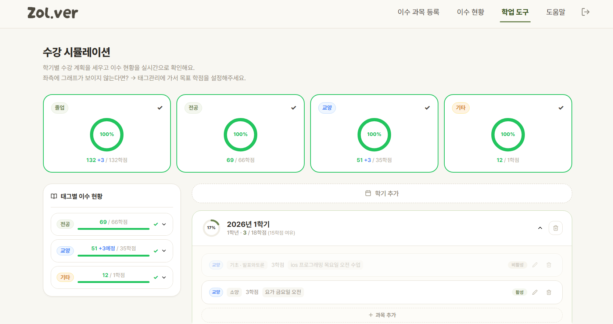
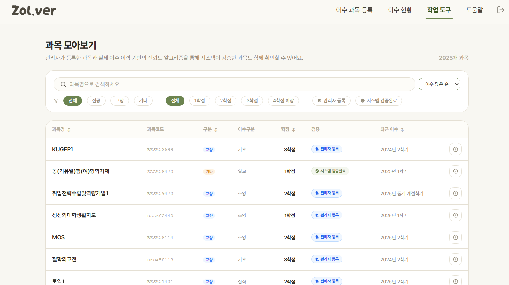
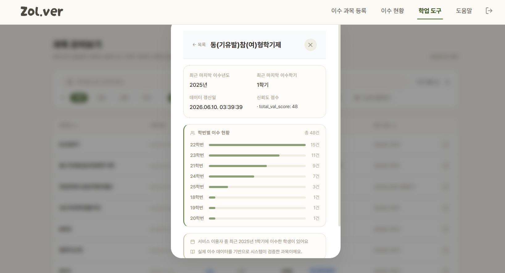

### AI 수강 추천
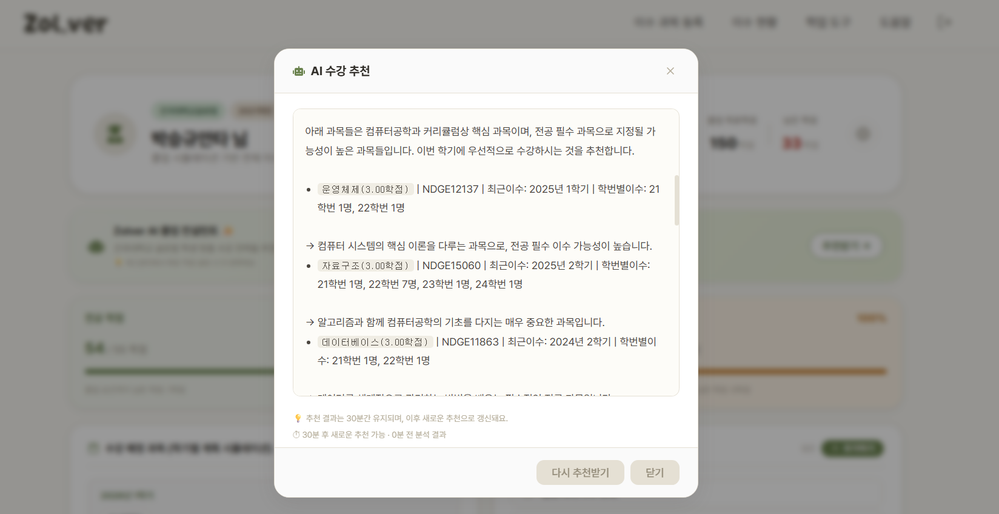

---

## 시스템 아키텍처

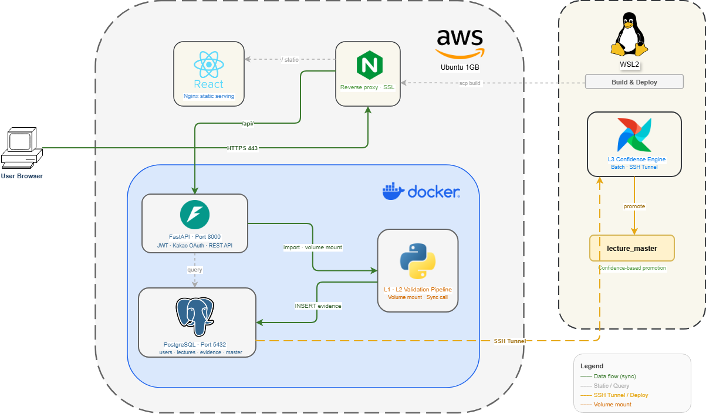

---

## 데이터 파이프라인

성적표 업로드 시점부터 과목 데이터가 `lecture_master`에 승격되기까지의 전체 흐름입니다.

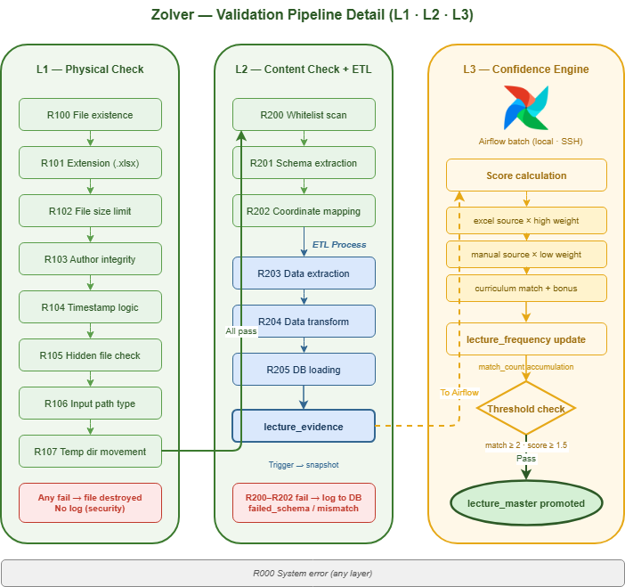

| 단계 | 레포 | 설명 |
|---|---|---|
| **L1 Physical Check** | zolver-worker | 파일 확장자·용량·수정자 메타데이터 위변조 검증 |
| **L2 Content Check** | zolver-worker | 고정 좌표 구조·헤더 텍스트 매칭으로 양식 무결성 검증 |
| **ETL** | zolver-worker | 추출(Extractor) → 정규화(Transformer) → DB 적재(Loader) |
| **L3 Confidence Engine** | zolver-airflow | 데이터 일치성 기반 신뢰도 점수 산출, lecture_master 승격 |

---

## AI 수강 추천 — 로직 상세

### 데이터 수집 우선순위

유저별 수강 추천 시 아래 데이터를 순서대로 활용합니다.

```
1. 유저 태그 달성 현황  →  부족한 졸업요건 파악
2. 유저 이수 과목       →  전공 학과 코드 추출 (lecture_code 앞 4자리)
3. lecture_master      →  해당 코드 과목 필터링
4. 정렬 우선순위:
   ① lecture_category에 '필' 포함 여부 (전필 유력 과목 우선)
   ② 본인 학번 기준 admission_stats 이수 수 (많은 순)
   ③ last_completed_year 최신 순
5. 졸업요건 메모        →  자격증·논문 등 학점 외 요건 고려
6. GPA 목표            →  학점 수와 난이도 조율
```

### 케이스별 추천 흐름

**케이스 1 — 단일 전공 (컴공)**
```
major_codes = {NDGE}
→ NDGE 과목 중 전필 유력 과목 우선 정렬
→ 21학번 이수 많은 과목 앞으로
→ 예: 운영체제(전필 유력, 21학번 6명) → 데이터베이스 → 빅데이터기초 순
```

**케이스 2 — 다전공 (컴공 + 경영)**
```
major_codes = {NDGE, BCGE}  ← system_category='major'인 과목 코드 전부 추출
→ NDGE + BCGE 과목 모두 필터링
→ 각 학과별 전필 유력 과목 우선
→ 예: 운영체제(NDGE) → 경영학원론(BCGE) → 자료구조(NDGE) 순
```

**케이스 3 — 전필 이수 완료, 전선만 부족**
```
lecture_master에서 '필' 포함 과목 없음 → is_required = 1로 동일
→ 2순위 기준(본인 학번 이수 수)으로 전선 과목 추천
→ 예: 빅데이터기초(21학번 8명) → 클라우드컴퓨팅(21학번 5명) 순
```

**케이스 4 — 다필/다선으로 타과 전공 이수**
```
타과 과목도 system_category='major'로 등록 → major_codes에 포함
→ 타과 코드 과목도 필터링 대상
→ lecture_master.lecture_category에 '필' 있으면 우선 정렬
```

> 이수구분(전필/전선 등)은 학번·커리큘럼마다 다를 수 있으므로 AI 답변에서 단정하지 않고 유연하게 표현합니다.

### 캐싱 전략

- 추천 결과는 DB(`users.ai_recommend`)에 저장, **30분간 캐시 유지**
- 30분 이내 재요청 시 API 호출 없이 저장된 결과 즉시 반환
- 추천 결과에 `ai_recommend_at` 타임스탬프 저장 → 프론트에서 쿨다운 표시

---

## ERD

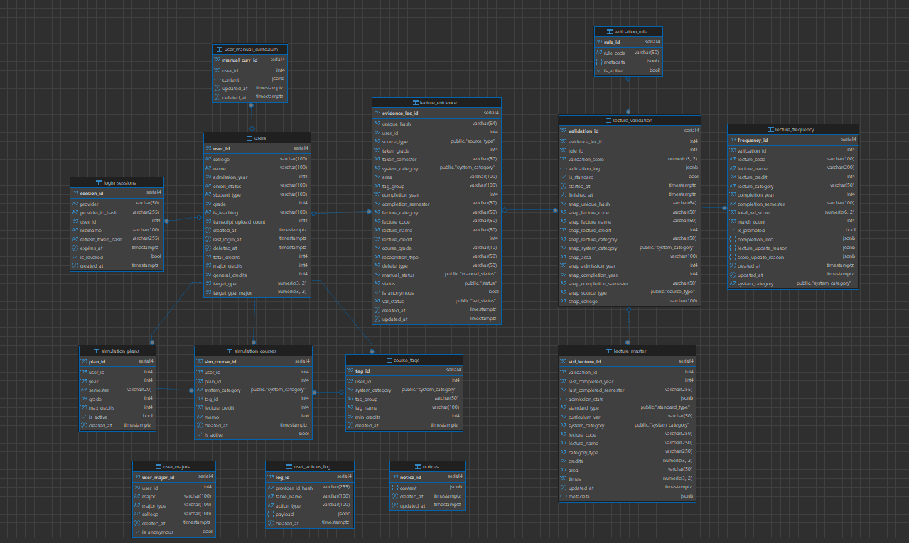

| 테이블 | 설명 |
|---|---|
| `users` | 유저 정보, 학과·학번·학점 목표·GPA 목표·AI 추천 캐시 |
| `login_sessions` | 카카오 OAuth 세션, refresh token hash |
| `lecture_evidence` | 성적표에서 파싱된 수강 이력 원본 |
| `lecture_validation` | L3 검증 결과 스냅샷 (rule별 점수) |
| `lecture_frequency` | 과목별 누적 match_count · val_score |
| `lecture_master` | 신뢰도 임계값 통과 후 승격된 과목 마스터 데이터 |
| `validation_rule` | L3 검증 규칙 정의 |
| `simulation_plans` | 수강 시뮬레이션 학기별 계획 |
| `simulation_courses` | 시뮬레이션에 등록된 예정 과목 |
| `course_tags` | 유저가 설정한 태그 (그룹·소분류·최소학점) |
| `user_majors` | 유저 학과·커리큘럼 버전 |
| `user_manual_curriculum` | 유저가 직접 등록한 졸업요건 메모 (자격증·논문 등) |
| `user_actions_log` | 유저 행동 로그 |
| `notices` | 공지사항 |

---

## 레포지토리

| 레포 | 설명 |
|---|---|
| **zolver-backend** | FastAPI REST API 서버 |
| **zolver-worker** | L1·L2 검증 파이프라인 (Worker) |
| **zolver-airflow** | L3 신뢰도 검증 Airflow DAG |
| **zolver-frontend** | React SPA |

---

## 기술 스택

| 분류 | 기술 |
|---|---|
| Frontend | React, Nginx |
| Backend | FastAPI, SQLAlchemy, PostgreSQL |
| AI | Google Gemini API (gemini-2.5-flash) |
| Worker | Python (L1·L2 검증 파이프라인) |
| Batch | Apache Airflow (L3, 로컬 + SSH 터널) |
| 인증 | 카카오 OAuth 2.0 |
| 인프라 | AWS EC2 (Ubuntu), Docker Compose |
| 개발 환경 | Windows + WSL2 |

---

## 라이선스

MIT License
